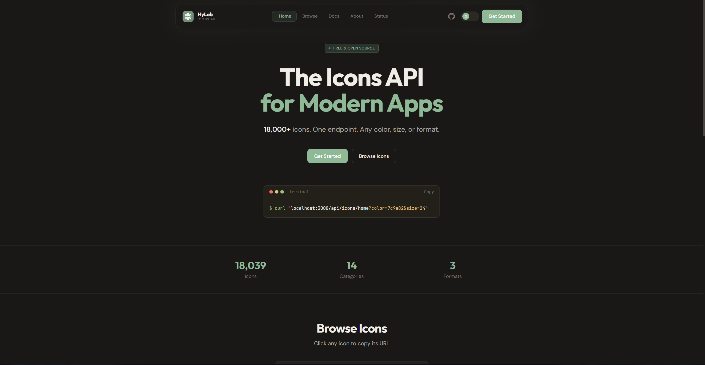

<div align="center">


# HyLab

### The Icons API for Modern Apps

**18,000+ icons. One endpoint. Any color, size, or format.**

<br/>

<a href="https://vercel.com/new/clone?repository-url=https://github.com"></a>
<a href="https://github.com"></a>
<a href="https://github.com"></a>
<a href="https://github.com"></a>

<br/>



</div>

---

## Quick Start

```bash
# No install needed — just use the URL
curl "https://hylab.vercel.app/api/icons/home?color=7c9a82&size=32"
```

```html
<!-- Drop it into any HTML -->

```

```tsx
// React component
import { HyIcon } from 'hylab-icons';

<HyIcon name="home" color="#7c9a82" size={32} />
```

---

## Features

<table>
<tr>
<td width="50%">

### One API, All Icons
No need to install 10 different icon packages. One endpoint serves them all.

</td>
<td width="50%">

### Fully Customizable
Change color, size, stroke width, and output format with simple query parameters.

</td>
</tr>
<tr>
<td>

### SVG, PNG & WebP
Get icons in any format. SVG for web, PNG for compatibility, WebP for performance.

</td>
<td>

### No Authentication
Free, open source, no API keys. Just make a request and get your icon.

</td>
</tr>
</table>

---

## API Reference

### Get Icon

```
GET /api/icons/:name
```

| Parameter | Type | Default | Description |
|-----------|------|---------|-------------|
| `name` | path | — | Icon name (e.g., `home`, `search`, `heart`) |
| `color` | query | `currentColor` | Hex color without `#` |
| `size` | query | `24` | Size in pixels (1–512) |
| `stroke` | query | `2` | Stroke width (0.5–4) |
| `format` | query | `svg` | Output format: `svg`, `png`, `webp` |

```bash
# SVG
curl "https://hylab.vercel.app/api/icons/home?color=7c9a82&size=32"

# PNG
curl "https://hylab.vercel.app/api/icons/home?format=png&size=64"

# WebP
curl "https://hylab.vercel.app/api/icons/home?format=webp&size=128"
```

### Search Icons

```
GET /api/icons/search?q=arrow
```

### List Categories

```
GET /api/icons/categories
```

### List Icon Sets

```
GET /api/icons/sets
```

### List Icons (Paginated)

```
GET /api/icons?page=1&limit=20&category=navigation
```

---

## Code Examples

<details>
<summary><strong>HTML</strong></summary>

```html


```

</details>

<details>
<summary><strong>React</strong></summary>

```tsx
import { HyIcon } from 'hylab-icons';

function App() {
  return (
    <div>
      <HyIcon name="home" color="#7c9a82" size={32} />
      <HyIcon name="search" color="#ffffff" size={24} />
      <HyIcon name="heart" color="#ef4444" size={48} format="png" />
    </div>
  );
}
```

</details>

<details>
<summary><strong>Next.js</strong></summary>

```tsx
// app/icon/[name]/route.ts
import { NextResponse } from "next/server";

export async function GET(
  request: Request,
  { params }: { params: { name: string } }
) {
  const url = new URL(request.url);
  const color = url.searchParams.get("color") || "7c9a82";
  const size = url.searchParams.get("size") || "24";

  const res = await fetch(
    `https://hylab.vercel.app/api/icons/${params.name}?color=${color}&size=${size}`
  );

  return new NextResponse(await res.blob(), {
    headers: {
      "Content-Type": "image/svg+xml",
      "Cache-Control": "public, max-age=86400",
    },
  });
}
```

</details>

<details>
<summary><strong>Vue</strong></summary>

```vue
<template>
  <span v-html="svg" />
</template>

<script setup>
import { ref, onMounted, watch } from "vue";

const props = defineProps({
  name: String,
  color: { type: String, default: "7c9a82" },
  size: { type: Number, default: 24 },
});

const svg = ref("");

const loadIcon = async () => {
  const res = await fetch(
    `/api/icons/${props.name}?color=${props.color}&size=${props.size}`
  );
  svg.value = await res.text();
};

onMounted(loadIcon);
watch(() => props.name, loadIcon);
</script>
```

</details>

<details>
<summary><strong>Svelte</strong></summary>

```svelte
<script>
  export let name;
  export let color = "7c9a82";
  export let size = 24;

  let svg = "";

  $: fetch(`/api/icons/${name}?color=${color}&size=${size}`)
    .then(r => r.text())
    .then(t => svg = t);
</script>

<span>{@html svg}</span>
```

</details>

<details>
<summary><strong>Python</strong></summary>

```python
import requests

# Get SVG
res = requests.get(
    "https://hylab.vercel.app/api/icons/home",
    params={"color": "7c9a82", "size": "32"}
)
svg_content = res.text

# Get PNG
res = requests.get(
    "https://hylab.vercel.app/api/icons/home",
    params={"format": "png", "size": "64"}
)
with open("icon.png", "wb") as f:
    f.write(res.content)

# Search
res = requests.get(
    "https://hylab.vercel.app/api/icons/search",
    params={"q": "arrow"}
)
icons = res.json()["data"]
```

</details>

---

## Icon Sources

| Source | Icons | License |
|--------|-------|---------|
| **Tabler** | 5,093 | MIT |
| **Remix** | 3,229 | Apache 2.0 |
| **Carbon** | 2,665 | Apache 2.0 |
| **Lucide** | 1,582 | ISC |
| **Phosphor** | 1,512 | MIT |
| **Iconoir** | 1,383 | MIT |
| **BoxIcons** | 814 | MIT |
| **Octicons** | 733 | MIT |
| **CSS.gg** | 704 | MIT |
| **Heroicons** | 324 | MIT |

**Total: 18,039 icons across 14 categories**

---

## Tech Stack

<div align="center">

<a href="https://nextjs.org"></a>
<a href="https://typescriptlang.org"></a>
<a href="https://tailwindcss.com"></a>
<a href="https://vercel.com"></a>

</div>

---

## Getting Started (Self-Host)

```bash
# Clone
git clone https://github.com
cd icon-api

# Install
npm install

# Run
npm run dev
```

Open [http://localhost:3000](http://localhost:3000)

---

## Contributing

Contributions are welcome! Please open an issue or submit a pull request.

---

## License

[MIT](https://github.com) — use freely in personal and commercial projects.

---

<div align="center">

**Built by [onyxax](https://guns.lol/onyxax)**

</div>
